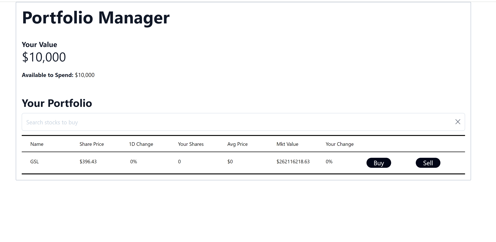

# Portfolio Learning Item
1. [What is a portfolio](#what-is-a-portfolio)
2. [Instructions](#instructions)
3. [Solutions](#solutions)

## What is a portfolio
A portfolio is a collection of these accounts, but also is any collection of investments/financial assets, including stock, bonds, derivatives, ETFs, etc. Accounts are technically a portfolio, but large firms will usually have multiple accounts with different trading strategies. The collection of these accounts represents their portfolio.

For example, I could have account tech strategy which contains the positions:

*2,000* shares of *MYSHR USD, 200* shares of *YRSHR USD, and 100* shares of *HSSHRE USD*

And an account healthcare strategy which contains the positions:

*1,000* shares of *HRSHRE USD, 200* shares of *ORSHRE USD, and 100* shares of *MYSHR USD*

The entire portfolio is the union of these two accounts. It's important to note that accounts within a portfolio need not be mutually exclusive in their positions.

## Instructions

Remember that in the previous labs, you defined and interacted with the `shares` array. This array contains the shares that you have purchased. By now, you might have tried to buy shares of a stock, without being able to see results. That is because up until now, we have been using a sample static share. Now, we are going to render all shares that we have purchased.

First, we are going to define some additional props for the `Share` component. Here is the list of props that you will define in the `Share` component:
1. symbol,
2. idx,
3. sharePrice,
4. oneDChange,
5. yourShares,
6. avgPrice,
7. mktValue,
8. yourChange,
10. hardCodedUserAmount,
11. setHardCodedUserAmount,
12. portfolioValue,
13. updatePortfolioValue

Then, insert the following hooks and hook variables inside the `Share` component function:
```jsx
const [revealBuyWindow, setRevealBuyWindow] = useState(false);
const [revealSellWindow, setRevealSellWindow] = useState(false);
```

For our purposes, we are representing a share object as an object with the following properties: `symbol`, `sharePrice`, `oneDChange`, `yourShares`, `avgPrice`, `mktValue`, `yourChange`. Replace the dummy values you had placed in the first lab with the parameters that have been deconstructed in the component function, in the same order as listed here. Additionally, you might find it handy to group all these properties under a JavaScript object, `share`.

As a way to help how, we provide the following code that you should append to the last `div` element of the `Share` component:
```jsx
<div className="border-y border-black py-4">
    <input className="rounded-full bg-slate-950 text-white text-lg w-1/2 hover:cursor-pointer" type="button" onClick={() => { setRevealBuyWindow(true); setRevealSellWindow(false) }} value="Buy"/>
</div>
<div className="border-y border-black py-4">
    <input className="rounded-full bg-slate-950 text-white text-lg w-1/2 hover:cursor-pointer" type="button" onClick={() => { setRevealSellWindow(true); setRevealBuyWindow(false) }} value="Sell"/>
</div>
{ !revealBuyWindow ? '' : <BuyWindow selectedShare={ ...share } handleCloseWindow={() => setRevealBuyWindow(false)} idx={idx} hardCodedUserAmount={hardCodedUserAmount} setHardCodedUserAmount={setHardCodedUserAmount} portfolioValue={portfolioValue} updatePortfolioValue={updatePortfolioValue} /> }
{ !revealSellWindow ? '' : <SellWindow selectedShare={ ...share } handleCloseWindow={() => setRevealSellWindow(false)} idx={idx} hardCodedUserAmount={hardCodedUserAmount} setHardCodedUserAmount={setHardCodedUserAmount} portfolioValue={portfolioValue} updatePortfolioValue={updatePortfolioValue} /> }
```
* Make sure to import the `BuyWindow` and `SellWindow` components that we provide for you
* In this code, we assume that you defined a `share` JS object that contains the share properties mentioned above, and then we deconstruct it using the spread syntax (`...`) (e.g. `...share`). If you'd like to avoid doing this, you would need to pass each share property listed above individually to the `selectedShare` attribute of the buy and sell window components

Replace the `<Share>` component JSX expression that you had in the `your-nextjs-app/src/pages/index.jsx` originally with a JavaScript expression that yields the empty string if `shares` is empty or if `isLoading` is set to true, else, yield an array of instances of the `Share` component. All objects of the `shares` array follow the structure of the `share` object described above, so you can access the above properties for each element of the array. Additionally, all other props that we defined above have already been defined in the `index.jsx` file, if all steps until now have been followed, and you should just simply pass the parameter values as props to the `Share` component.
* Hint: Use the `map` method of an array to build a JavaScript expression that yields an array of `Share` component instances. An example of this syntax would be `shares.map(share, idx) => <Share ...></Share>`
* Don't forget to pass an `idx` prop to the `Share` component

## Bonus Minilab

Using the following function:
```jsx
function getOneDayChangeCSSClass() {
    let color = "";
    if (oneDChange > 0) {
        color = "green";
    } else if (oneDChange < 0) {
        color = "red";
    } else {
        color = "orange";
    }
    return `bg-${color}-200 border-${color}-200 rounded`;
}
```

Can you you style the `oneDChange` value of the share in the `your-nextjs-app/src/components/Share.jsx`? The function yields a green color class if the `oneDChange` is greater than 0, red if it is less than 0, and orange otherwise. Use this function somewhere in the `div` element that contains the `oneDChange` to apply the result of this function. Additionally, if the `oneDChange` is positive, prepend a "+" sign to it, and if it is negative, prepend a "-" sign to it.

## Solutions
This is how your work should look like after completing this task:



You can also take a look at the `Solution` directory for reference.
